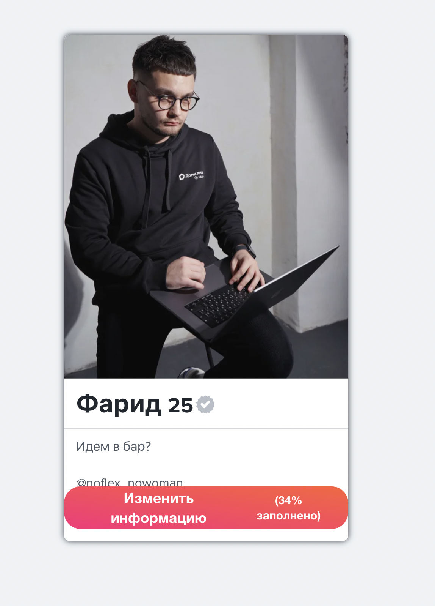
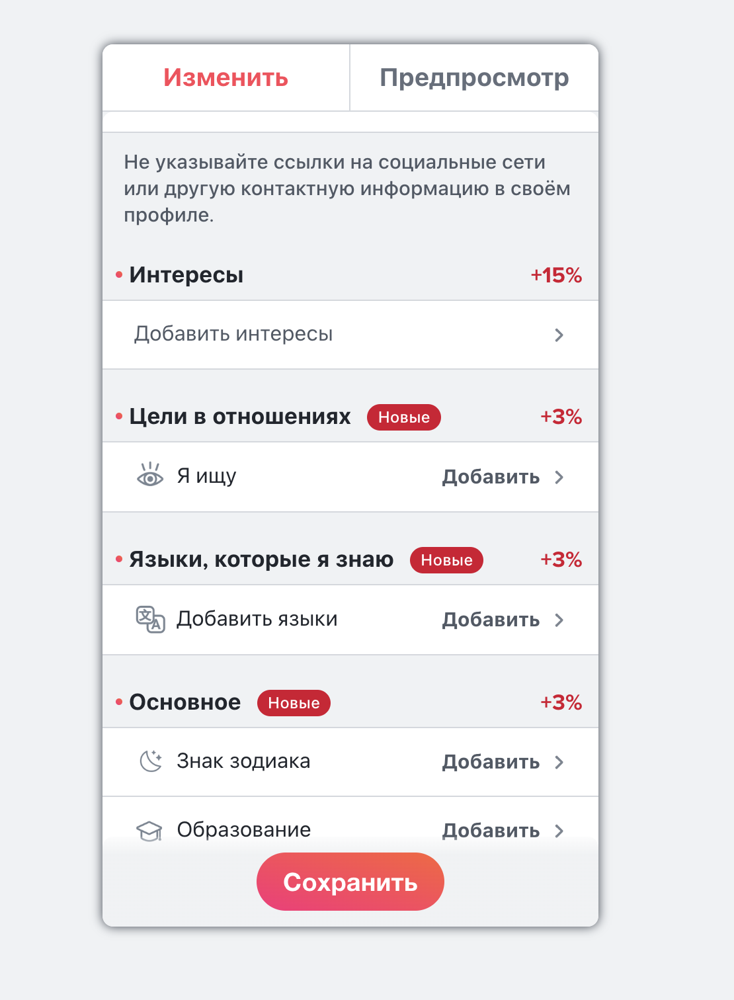
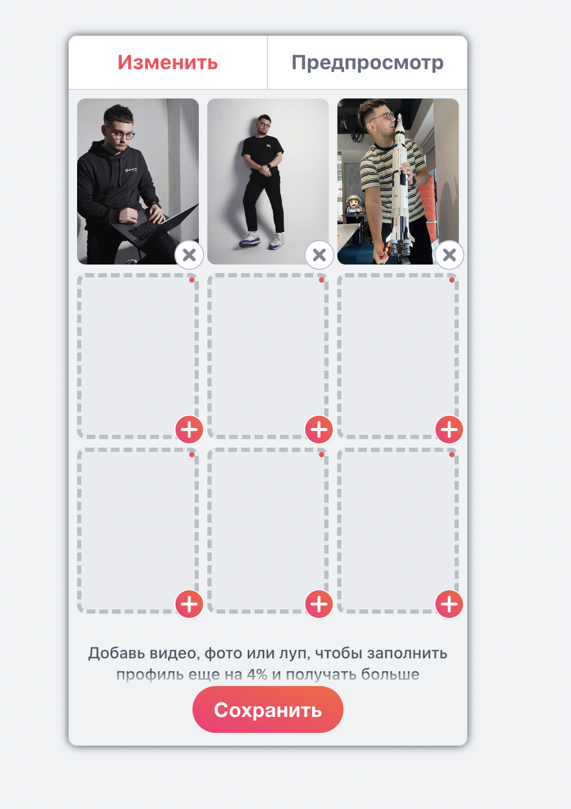
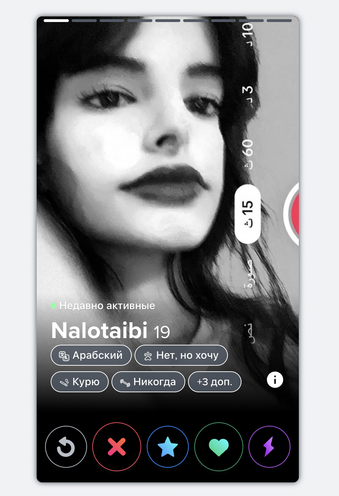
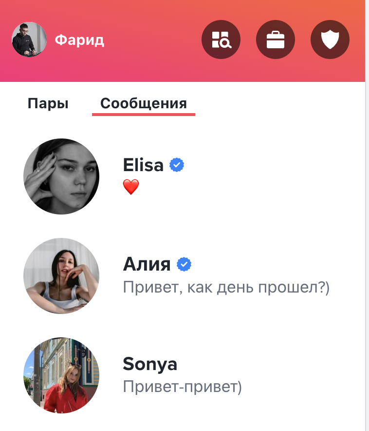

# Swipe - сервис для романтических знакомств

Учебный проект
курса [Kotlin Backend Developer](https://otus.ru/lessons/kotlin/?int_source=courses_catalog&int_term=programming). Поток курса 2023-04. 

**Swipe** - это сервис, для романтических знакомств, где пользователь может заполнить информацию о себе и найти
партнера по интересам.

## Документация

1. Маркетинг
    1. [Заинтересанты](./docs/marketing/02-stakeholders.md)
    2. [Целевая аудитория](./docs/marketing/01-target-audience.md)
    3. [Конкурентный анализ](./docs/marketing/03-concurrency.md)
    4. [Анализ экономики](./docs/marketing/04-economy.md)
    5. [Пользовательские истории](./docs/marketing/05-user-stories.md)
    
## Документация

2. DevOps
    1. [Схема архитектуры](./docs/architecture/structure.md)

## Визуальная схема фронтенда

